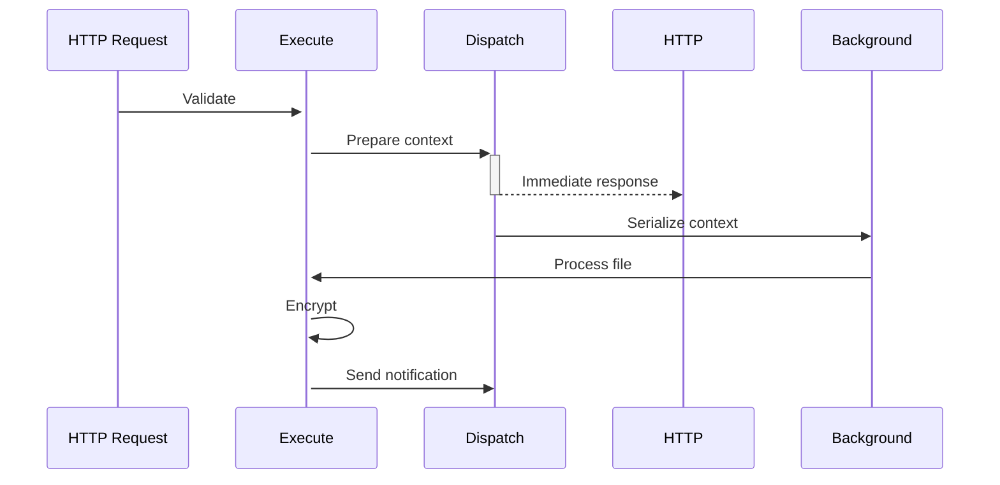

# distributed-core

**Build Powerful, Pluggable & Distributed Data Pipelines**  

[](https://www.python.org/)
[](https://opensource.org/license/apache-2-0)

`distributed-core` is a Python framework for building composable data processing pipelines that scale from single machines to distributed systems. Create complex workflows by assembling reusable plugins, with built-in support for asynchronous processing, error handling, and distributed execution.

## Why distributed-core?

✅ **Pluggable Architecture** - Swap implementations with configuration  
✅ **Distributed-Ready** - Built-in async handoff for background processing  
✅ **Type-Safe Contexts** - Pydantic-powered data validation  
✅ **Declarative Pipelines** - Chain stages like building blocks  
✅ **Production-Grade** - Coming soon: Error recovery, distributed locking, and observability  

## Core Concepts

### 1. PipelineContext
Your data container - defines inputs/outputs for pipeline operations:
```python
class FileJobContext(PipelineContext):
    file_path: str
    file_content: bytes
    job_id: UUID = Field(default_factory=uuid4)
```

### 2. Execute Plugins
Synchronous processing units (filters/transformers):
```python
class StorageWriter(Execute):
    def execute(self, next_fn, context: FileJobContext):
        # Save file to storage
        minio_client.put_object(context.file_path, context.file_content)
        return next_fn(context)  # Continue pipeline
```

### 3. Dispatch Plugins
Terminal stages for async handoff:
```python
class JobScheduler(Dispatch):
    def dispatch(self, next_fn, context: FileJobContext):
        # Enqueue remainder of pipeline
        queue.enqueue(process_file, context.model_dump_json())
```

### 4. Pipeline Assembly
Chain components declaratively:
```python
def process_file(context: FileJobContext):
    pipeline = context.create_pipeline(final_fn=finalize_processing)
    pipeline.chain(Execute("validate"))
          .chain(Execute("encrypt"))
          .chain(Dispatch("schedule_processing"))
```

## Quick Start

### Installation
```bash
pip install distributed-core
```

### Example: File Processing Pipeline
```python
from fastapi import FastAPI, UploadFile
from distributed_core import PipelineContext, Execute, Dispatch

app = FastAPI()

# 1. Define Context
class FileContext(PipelineContext):
    content: bytes
    filename: str
    processed: bool = False

# 2. Create Plugins
@register_plugin
class Archiver(Execute):
    def execute(self, next_fn, context: FileContext):
        save_to_cloud_storage(context.filename, context.content)
        return next_fn(context)

@register_plugin
class NotifyUser(Dispatch):
    def dispatch(self, next_fn, context: FileContext):
        send_email(f"File {context.filename} processed!")
        return {"status": "queued"}

# 3. Build & Run Pipeline
@app.post("/upload")
async def upload(file: UploadFile):
    ctx = FileContext(content=await file.read(), filename=file.filename)
    
    pipeline = ctx.create_pipeline()
    pipeline.chain(Execute("archiver")).chain(Dispatch("notify_user"))
    
    return pipeline.run()
```

## Key Features

### 🧩 Pluggable Components
```python
# Swap implementations via configuration
pipeline.chain(Execute("storage", plugin="s3"))  # → s3, minio, gcs, local
        .chain(Dispatch("jobs", plugin="celery")) # → celery, rq, fastapi_background
```

### 🔗 Distributed Execution


### 🛡️ Upcoming Production Features
```python
# Phase 1 (v1.1)
pipeline.error_handler(DeadLetterQueue("dlq_topic"))

# Phase 2 (v1.2)
with DistributedLock(resource="s3_bucket", timeout=10):
    pipeline.chain(Execute("critical_operation"))
    
# Phase 3 (v1.3)
pipeline.instrument(OpenTelemetryCollector())
```

## Documentation Roadmap

| Version | Features |
|---------|----------|
| `v1.0` | Core pipeline execution, FastAPI integration |
| `v1.1` | Error handling, retry policies, dead-letter queues |
| `v1.2` | Distributed locking, connection pooling |
| `v1.3` | OpenTelemetry integration, sharding support |

**[Explore Full Documentation](https://github.com/yourorg/distributed-core/wiki)** (Coming Soon)

## Contributing

We welcome contributions! Follow these steps:

1. Fork the repository
2. Install dev dependencies:
   ```bash
   pip install -e ".[dev]"
   ```
3. Run tests:
   ```bash
   pytest -xvs
   ```
4. Submit a PR with tests

> **Note**: This project adheres to [Semantic Versioning](https://semver.org/).  
> Currently in **alpha** (v0.1.0) - interfaces may change until v1.0.

## License

Distributed under MIT License. See `LICENSE` for details.

---

**Ready to build resilient data pipelines?**  
⭐ Star this repo to stay updated on our progress!